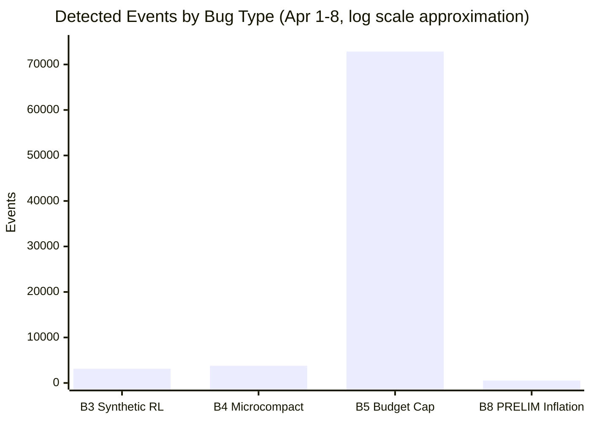

> 이 문서는 [영어 원본](../01_BUGS.md)의 한국어 번역입니다.

# 버그 상세 -- 기술적 근본 원인 분석

> 버그 1-2 (캐시 레이어)는 v2.1.91에서 **수정됨**. 버그 3-5, 8, 8a, 9, 10은 v2.1.101 기준 **미수정**. 버그 2a는 **수정 가능** 상태입니다 (v2.1.101 resume 수정이 SDK 경로를 포함할 수 있음). 버그 11은 인정되었으나 미해결입니다. **8개 릴리스(v2.1.92-v2.1.101)에서 9개 미수정 버그에 대한 수정이 전혀 없었습니다.** P3("Output efficiency" 프롬프트)는 v2.1.98과 v2.1.101 사이에 **제거 확인**되었습니다 (자체 검증: 353개 JSONL 세션 스캔, 4월 10일 이후 0건). 아래 [Changelog 교차 참조](#changelog-cross-reference-v2192v21101)를 참조하십시오. (최신: 2026년 4월 14일)
>
> 버그 1-2는 커뮤니티 리버스 엔지니어링을 통해 확인되었습니다 ([Reddit](https://www.reddit.com/r/ClaudeAI/s/AY2GHQa5Z6)). 버그 3-5와 8은 4월 2-3일 프록시 기반 테스트를 통해 발견되었습니다. 버그 8a-11과 2a는 2026년 4월 6-9일 커뮤니티 전반의 이슈/코멘트 분석 및 팩트체킹을 통해 식별되었습니다.

---

## 버그 1 -- Sentinel 치환 (standalone 바이너리 전용)

**GitHub Issue:** [anthropics/claude-code#40524](https://github.com/anthropics/claude-code/issues/40524)

standalone 바이너리에 내장된 Bun fork에는 `cch=00000` sentinel 치환 메커니즘이 포함되어 있습니다. 특정 조건에서 `messages` 안의 sentinel이 잘못 치환되면서 캐시 prefix가 깨지고, 전체를 처음부터 다시 구축해야 하는 상황이 발생합니다.

- **v2.1.89:** 치명적 -- 캐시 read가 4-17%로 하락, 복구 불가
- **v2.1.90:** 부분 완화 -- cold start 시에는 여전히 영향 (47-67%), warming 후 94-99%로 복구
- **npm:** 영향 없음 -- JavaScript 번들에는 이 로직이 포함되지 않음

**v2.1.89-90 공식 수정 ([changelog](https://code.claude.com/docs/en/changelog)):**
- v2.1.89: *"Fixed prompt cache misses in long sessions caused by tool schema bytes changing mid-session"*
- v2.1.90: *"Improved performance: eliminated per-turn JSON.stringify of MCP tool schemas on cache-key lookup"*

---

## 버그 2 -- Resume 캐시 파손 (v2.1.69+)

**GitHub Issue:** [anthropics/claude-code#34629](https://github.com/anthropics/claude-code/issues/34629)

`deferred_tools_delta` (v2.1.69에서 도입)로 인해 `--resume` 시 첫 번째 메시지의 구조가 서버에 캐시된 버전과 달라집니다 -- 완전한 캐시 미스가 발생합니다. 500K 토큰 대화에서 resume 한 번이면 전체 context를 정가로 다시 입력하는 것과 동일합니다 -- 처음부터 전체 대화를 재전송하는 것과 같습니다.

**v2.1.90 공식 수정 ([changelog](https://code.claude.com/docs/en/changelog)):**
> *"Fixed --resume causing a full prompt-cache miss on the first request for users with deferred tools, MCP servers, or custom agents (regression since v2.1.69)"*

**참고:** `--continue`도 동일한 캐시 무효화 동작을 보입니다 ([#42338](https://github.com/anthropics/claude-code/issues/42338) 확인). 완전히 검증될 때까지 `--resume`과 `--continue` 모두 사용을 피하고, 새 세션을 시작하는 것을 권장합니다.

### 참고: 수정 후에도 잔존하는 첫 턴 캐시 미스 (자체 측정, 4월 13일)

B1/B2 수정 이후(v2.1.91+)에도 새 세션은 첫 API 호출 시 `cache_read=0`을 자주 나타냅니다. 커뮤니티 분석 ([#47098](https://github.com/anthropics/claude-code/issues/47098), [@wadabum](https://github.com/wadabum))이 구조적 원인을 식별하였습니다: skills와 프로젝트 `CLAUDE.md` 콘텐츠가 `system[]` 접두사가 아닌 `messages[0]` user-content 블록에 조립됩니다. Anthropic의 프롬프트 캐싱은 **prefix 기반**이므로, `messages[0]`에 변화가 있으면 system prompt 자체가 동일하더라도 prefix가 무효화됩니다.

**자체 측정 (4월 13일, cc-relay usage.db):**

| 지표 | 값 |
|------|-----|
| 분석된 세션 (요청 3건 이상) | 143 |
| 첫 턴 `cache_read=0` | **113 (79.0%)** |
| 첫 턴 `cache_read>0` | 30 (21.0%) |
| 데이터 소스 | cc-relay 프록시, 4월 4-13일, 다수 CC 버전 |

새 세션 5개 중 약 4개가 첫 턴에서 전체 캐시 미스로 시작합니다. 이것은 B1/B2의 회귀가 아니라, 시스템 프롬프트 조립 아키텍처의 **구조적 한계**입니다. 최신 버전에서 부분적으로 완화 중이지만(커뮤니티 데이터에 따르면 v2.1.94의 ~91%에서 v2.1.104의 ~29%로 개선, 단 소규모 샘플과 비통제 조건), 여전히 상당한 첫 턴 비용이 발생합니다.

---

## 버그 3 -- 클라이언트 측 거짓 Rate Limiter (전 버전)

**GitHub Issue:** [anthropics/claude-code#40584](https://github.com/anthropics/claude-code/issues/40584)

로컬 rate limiter가 Anthropic API를 전혀 호출하지 않고도 **가짜 "Rate limit reached" 오류**를 생성합니다. 이 오류는 세션 로그에서 다음과 같이 식별할 수 있습니다:

```json
{
  "model": "<synthetic>",
  "usage": { "input_tokens": 0, "output_tokens": 0 }
}
```

대규모 대화 기록과 동시 sub-agent 생성 시 트리거됩니다. [@rwp65](https://github.com/rwp65)가 [#40584](https://github.com/anthropics/claude-code/issues/40584)에서 ~74MB 대화 기록으로 이 현상을 관찰하였습니다. rate limiter가 `context_size x concurrent_requests`를 곱하는 것으로 보이며, 개별 요청이 작더라도 멀티 에이전트 워크플로우 전체가 차단됩니다.

- **발견:** [@rwp65](https://github.com/rwp65), [#40584](https://github.com/anthropics/claude-code/issues/40584) (2026년 3월 29일)
- **교차 참조:** [@marlvinvu](https://github.com/marlvinvu), [#40438](https://github.com/anthropics/claude-code/issues/40438), [#39938](https://github.com/anthropics/claude-code/issues/39938), [#38239](https://github.com/anthropics/claude-code/issues/38239) 간 분석
- **상태:** **미수정** -- v2.1.97까지 전 버전에 존재
- **영향:** 몇 시간 동안 쉬다가 사용해도 즉시 "Rate limit reached"가 표시될 수 있습니다. 예산이 완전히 리셋되어 있어야 정상인 시점입니다. API 호출이 이루어지지 않으므로, 이 오류는 전적으로 클라이언트에서 생성된 것입니다.

---

## 버그 4 -- Silent Microcompact → Context 품질 저하 (전 버전, 서버 제어)

**GitHub Issue:** [anthropics/claude-code#42542](https://github.com/anthropics/claude-code/issues/42542)

`src/services/compact/`에 있는 세 가지 compaction 메커니즘이 **매 API 호출마다 사용자에게 알리지 않고** 실행되며, 이전 도구 결과를 삭제합니다.

| 메커니즘 | 소스 | 트리거 | 제어 |
|----------|------|--------|------|
| **시간 기반 microcompact** | `microCompact.ts:422` | 마지막 assistant 메시지 이후 간격이 임계값 초과 | GrowthBook: `getTimeBasedMCConfig()` |
| **캐시된 microcompact** | `microCompact.ts:305` | 횟수 기반 트리거, `cache_edits` API를 사용하여 이전 tool 결과 삭제 | GrowthBook: `getCachedMCConfig()` |
| **세션 메모리 compact** | `sessionMemoryCompact.ts:57` | autocompact 전에 실행 | GrowthBook flag |

**주요 발견:**
- 세 가지 모두 `DISABLE_AUTO_COMPACT` 및 `CLAUDE_AUTOCOMPACT_PCT_OVERRIDE`를 우회합니다
- **서버 측 GrowthBook A/B 테스트 flag**로 제어됩니다 -- Anthropic이 클라이언트 업데이트 없이 동작을 변경할 수 있습니다
- 도구 결과가 `[Old tool result content cleared]`로 조용히 교체됩니다 -- 압축 알림이 표시되지 않습니다
- 프록시를 통해 **5,500건의 삭제 이벤트**(18,858 항목 삭제)가 감지되었습니다 (4월 1-13일). 버그 발견은 4월 2일; 프록시 시작은 4월 1일. 이전 수치 327건은 4월 3일 집중 테스트만 포함
- 삭제된 인덱스가 모두 **짝수** → tool_use/tool_result 쌍을 정확히 타겟팅합니다
- 대화가 길어짐에 따라 삭제 범위가 **점진적으로 확장**됩니다

**캐시 영향 (4월 3일 업데이트 -- 측정치):**

프록시 기반 테스트 결과, 초기 가설에 대한 **수정사항**이 밝혀졌습니다: microcompact가 메인 세션에서 지속적인 캐시 문제를 일으키지는 않습니다.

| 컨텍스트 | clearing 중 캐시 비율 |
|----------|----------------------|
| 메인 세션 | **99%+** -- 영향 없음 (안정적인 치환으로 prefix 유지) |
| Sub-agent cold start | **0-39%** -- 삭제 시점에서 하락 관찰 |
| Sub-agent warmed | **94-99%** -- 정상 복구 |

캐시 비율이 높게 유지되는 이유는 동일한 `[Old tool result content cleared]` 마커가 매번 일관되게 치환되어 호출 간 프롬프트 prefix가 보존되기 때문입니다. 하지만 모델이 더 이상 원본 파일 내용이나 명령 출력을 볼 수 없고, placeholder만 보게 됩니다. 실질적으로 에이전트가 이전 도구 결과를 정확히 인용할 수 없고, 이미 시도한 접근 방식을 다시 시도할 수 있습니다. [@Sn3th](https://github.com/Sn3th)는 1M 토큰 윈도우가 있는데도 50회 이상 도구를 사용한 세션에서 실효 context가 ~40-80K 토큰으로 줄어든다고 보고하였습니다 -- 사용 가능한 context의 92-96%가 감소하는 것입니다.

- **업데이트 (4월 3일):** 4대 머신 / 4개 계정에 걸친 GrowthBook flag 조사에서 **모든 게이트가 비활성화** 상태였습니다 -- 그런데도 context가 여전히 삭제되었습니다 (문서화된 세 가지 GrowthBook 게이트 메커니즘과는 독립적인 compaction 코드 경로). 전체 분석은 [05_MICROCOMPACT.md](../05_MICROCOMPACT.md)를 참조하십시오.
- **발견:** [@Sn3th](https://github.com/Sn3th), [#42542](https://github.com/anthropics/claude-code/issues/42542) (2026년 4월 2일)
- **상태:** v2.1.91에서 **미수정**. v2.1.91 테스트 세션에서 동일한 패턴의 14건 이벤트가 감지되었습니다.

---

## 버그 5 -- Tool Result Budget 적용 (전 버전)

**발견:** 2026년 4월 3일 (cc-relay 프록시 개선을 통해)
**소스:** [@Sn3th](https://github.com/Sn3th)가 GrowthBook flag를 식별; 동작 활성화를 확인.

**별도의 요청 전 파이프라인**인 `applyToolResultBudget()`이 서버 제어 임계값에 따라 도구 결과를 잘라냅니다. 이것은 microcompact(버그 4)보다 먼저 실행되며 독립적으로 동작합니다.

**활성 GrowthBook flag (`~/.claude.json`에서 확인):**
```
tengu_hawthorn_window:       200,000  (aggregate tool result cap across all messages)
tengu_pewter_kestrel:        {global: 50000, Bash: 30000, Grep: 20000, Snip: 1000}
tengu_summarize_tool_results: true    (system prompt tells model to expect clearing)
```

**측정된 영향:**
- 218개 세션에 걸쳐 **167,818건의 budget 이벤트** (4월 1-13일). 이전 수치 261건은 단일 세션(4월 3일)만 포함
- **100% 잘림률** -- 모든 이벤트가 내용 축소를 초래
- **90.6%의 이벤트**가 11-100자로 잘림; 9.4%는 0-10자로 잘림 (평균: 24자)
- **242,094자**(200K 상한 초과)에서 budget 임계값을 넘었습니다
- 대략 파일 읽기 15-20회 이후부터 이전에 읽은 결과들이 조용히 잘려 나가기 시작합니다

**v2.1.91:** `_meta["anthropic/maxResultSizeChars"]` (최대 500K) 추가 -- 그러나 이는 **MCP tool 결과**에만 적용됩니다. 내장 도구(Read, Bash, Grep, Glob, Edit)는 이 override의 **영향을 받지 않습니다**. 일반 사용에서 200K 합산 상한은 그대로 유지됩니다.

**환경 변수로 끌 수 있는 방법이 없습니다.** `DISABLE_AUTO_COMPACT`, `DISABLE_COMPACT` 및 기타 알려진 모든 환경 변수가 이 코드 경로에 영향을 주지 않습니다.

### GrowthBook Flag 오버라이드 -- 제어된 제거 테스트 (4월 10-14일)

4월 10일에, 주 측정 머신(ubuntu-1, Max 20x)에서 프록시 기반 GrowthBook flag 오버라이드를 배포하였습니다 (커뮤니티 멤버들이 [#42542](https://github.com/anthropics/claude-code/issues/42542)에 문서화한 접근법).

컨텍스트 관리 관련 5개 flag(도구 결과 예산, 도구별 상한, 시간 기반 컴팩션, SM 컴팩트 임계값, 강제 요약)를 서버가 할당한 제한적 기본값에서 허용적 값으로 오버라이드하였습니다.

**결과:**

| 기간 | 요청 수 | B5 이벤트 | B4 이벤트 | 환경 |
|------|---------|-----------|-----------|------|
| 4월 1일 -- 4월 10일 14:25 | 25,558 | 167,818 | 5,500 | 오버라이드 없음 -- 깨끗한 기준선 |
| **4월 10일 14:25 -- 4월 14일** | **4,919** | **0** | **0** | 오버라이드 활성 |

마지막 B5 이벤트: **2026년 4월 10일 14:25:04 KST**. 마지막 B4 이벤트: **2026년 4월 10일 19:55:47 KST**. 이 시점 이후 4일간 4,919건의 요청에서 이벤트 0건 -- 동일한 머신, 동일한 계정, 동일한 사용 패턴. 변경된 유일한 변수는 GrowthBook flag 값이었습니다.

**데이터 해석에 대한 중요한 주의사항:** 이 저장소의 **4월 11일 이후** 모든 프록시 데이터는 flag 오버라이드가 활성화된 상태에서 수집되었습니다. 해당 날짜의 B4/B5 이벤트 수는 기본 CC 동작이 아닌 오버라이드된 환경을 반영합니다. **변경되지 않은 기준선 기간은 4월 1-10일**(25,558건 요청)입니다. 누적 이벤트 수(예: "167,818건 B5 이벤트")를 인용할 때, 이는 전적으로 기준선 기간의 것입니다.

---

> **넘버링 참고:** 버그 6과 7은 조사 과정에서 확인되었으나(compaction 무한 루프와 OAuth 재시도 폭주), 재현이 어려운 과거 이슈로 [07_TIMELINE.md](../07_TIMELINE.md)에서 별도로 추적합니다. 이 문서는 현재 측정 가능한 버그에 집중합니다.

---

## 버그 8 -- JSONL 로그 중복 (전 버전)

> **아래 버그 8a도 참조하십시오** -- 4월 9일에 발견된 관련되었지만 별개의 JSONL 손상 버그입니다.

**GitHub Issue:** [anthropics/claude-code#41346](https://github.com/anthropics/claude-code/issues/41346)

Extended thinking이 활성화되면, 세션 JSONL 파일에 API 호출 한 번당 **2-5개의 PRELIM 항목**이 기록됩니다. FINAL 항목과 동일한 `cache_read_input_tokens` 및 `cache_creation_input_tokens` 값을 포함합니다. 이로 인해 로컬 토큰 집계가 부풀려집니다.

**측정치 (4월 3일, 단일 세션):**

| 세션 유형 | PRELIM | FINAL | 비율 | 토큰 인플레이션 |
|----------|--------|-------|------|----------------|
| 메인 세션 | 79 | 82 | 0.96x | **2.87x** |
| Sub-agent | 39 | 20 | 1.95x | -- |
| Sub-agent | 12 | 7 | 1.71x | -- |
| 이전 세션 | 16 | 6 | **2.67x** | -- |

**대량 스캔 (4월 8일, 532 파일):** B8은 **전 세션 공통**입니다 -- 최대 10개 세션 전부에서 PRELIM/FINAL 중복이 나타납니다. 평균 토큰 인플레이션: **2.37x** (범위 1.45x-4.42x). 최악의 경우: 734f00e7에서 4.42x (기록된 입력 토큰의 77%가 중복된 PRELIM 항목).

**미결 질문:** 서버 측 rate limiter가 PRELIM 항목을 카운트하는가? 만약 그렇다면, extended thinking 세션은 실제 API 사용량의 2-3배에 해당하는 rate limit이 부과됩니다.

---

## 버그 8a -- JSONL 비원자적 쓰기 손상 (v2.1.85+)

**GitHub Issues:** [#45286](https://github.com/anthropics/claude-code/issues/45286), [#31328](https://github.com/anthropics/claude-code/issues/31328), [#21321](https://github.com/anthropics/claude-code/issues/21321)

**추가:** 2026년 4월 9일

버그 8(중복)과는 별개입니다. Claude Code가 여러 도구를 동시에 실행할 때, JSONL 기록기가 `tool_result` 항목을 누락시킬 수 있으며, 고아(orphaned) `tool_use` 블록이 생성됩니다. 이후 모든 API 호출이 유효성 검사 실패(400 오류)로 세션이 **영구적으로 resume 불가능**해집니다.

- Assistant 메시지에 3개의 `tool_use` 블록이 있지만, 다음 user 메시지에는 2개의 `tool_result` 블록만 포함 -- 누락된 결과가 디스크에 기록되지 않았습니다
- 메타 이슈 [#21321](https://github.com/anthropics/claude-code/issues/21321)이 동일한 실패 패턴의 **10건 이상의 중복 보고**를 통합합니다
- 근본 원인: 동시 도구 실행 중 비원자적 JSONL 쓰기. 표준 수정(임시 파일 + fsync + rename)이 적용되지 않았습니다

**증거 강도:** **STRONG** -- 세 개의 독립적인 이슈(#45286, #31328, #21321)가 서로 다른 보고자와 버전에서 동일한 실패 패턴을 설명합니다. 빈도("도구를 많이 사용하는 세션 10건 중 ~1건"이라는 한 보고자의 주장)는 미검증입니다.

---

## 버그 9 -- `/branch` Context 인플레이션 (전 버전)

**GitHub Issues:** [#45419](https://github.com/anthropics/claude-code/issues/45419), [#40363](https://github.com/anthropics/claude-code/issues/40363), [#36000](https://github.com/anthropics/claude-code/issues/36000)

**추가:** 2026년 4월 9일

`/branch`가 메시지 히스토리를 중복하거나 압축을 해제하여, 부모 세션의 실제 크기를 훨씬 초과하는 context 인플레이션을 유발합니다.

**측정치 (4월 8일, @progerzua):**
- 부모 세션: **6% context** (59.7K/1M)
- `/branch` + **메시지 하나** 이후: **73% context** (735K/1M)
- Messages 카테고리만 인플레이션 (40.5K → 715.6K). 다른 모든 카테고리는 변동 없음.

**근본 원인 (#40363에서):** `/branch`가 세션 파일에 모든 메시지를 **두 번** 기록합니다 -- 부모가 8,892행/33MB였는데, branch는 즉시 12,050+행. 관련 경로(#36000): autocompaction 이후, `/branch`가 압축 전 히스토리와 요약본을 함께 복사하여, 사실상 압축을 되돌립니다.

**B4/B5와의 상호작용:** 인플레이션된 context(735K)가 즉시 공격적인 microcompact 삭제(B4)를 트리거하고 200K 도구 결과 budget(B5)을 초과합니다. 정상 세션은 B5에 도달하기까지 15-20회의 파일 읽기가 필요하지만, `/branch` 이후에는 첫 도구 호출에서 트리거될 수 있습니다.

**증거 강도:** **STRONG** -- 3건의 중복 이슈, 스크린샷 + 카테고리 분류, 알려진 근본 원인. 기존 오픈 이슈 #40363의 중복으로 자동 닫힘.

---

## 버그 10 -- TaskOutput 폐기 → Autocompact 스래싱 (v2.1.92+)

**GitHub Issue:** [#44703](https://github.com/anthropics/claude-code/issues/44703)

**추가:** 2026년 4월 9일

`TaskOutput` 도구의 폐기(deprecation) 메시지가 에이전트에게 요약된 Agent 도구 결과 대신 전체 sub-agent `.output` 파일을 `Read`하도록 지시합니다. 에이전트 작업의 경우, 이것이 전체 대화 히스토리를 주입합니다.

**측정치:**
- Agent 도구 요약: **4,087자**
- Read를 통한 전체 `.output` 파일: **87,286자** (21배 더 큼)
- ~167K 토큰의 연속 3회 autocompact → **"Autocompact is thrashing" 치명적 오류**

논리 체인: 폐기 메시지 → 에이전트가 지시를 따름 → 전체 대화 JSON 읽기 → 87K context에 주입 → autocompact 임계값 도달 → compact 실행 → 다음 알림에서 같은 Read 반복 → 스래싱 → 치명적 오류.

**버그 5와의 상호작용:** 87K 주입은 B5의 200K 합산 도구 결과 budget의 거의 절반을 즉시 소비하여, 모든 이전 도구 결과의 잘림을 가속합니다. B10은 별개의 근본 원인(폐기 메시지 설계)이지만, B5의 budget cap에 의해 심각성이 증폭됩니다 -- 200K 제한이 없었다면 87K 주입은 크지만 생존 가능한 수준이었을 것입니다.

**증거 강도:** **STRONG** -- 구체적인 JSONL 로그 증거, 내부적으로 일관된 수치, 기존 중복 #24764가 있는 알려진 실패 모드(autocompact 스래싱). Anthropic이 `has repro` 레이블을 붙이고 닫았지만, 엔지니어 코멘트나 확인된 수정은 없습니다.

---

## 버그 11 -- Adaptive Thinking Zero-Reasoning (서버 측, 인정됨)

**소스:** [bcherny (Anthropic)](https://news.ycombinator.com/item?id=47668520) on Hacker News, 2026년 4월 6일

**추가:** 2026년 4월 9일

Adaptive thinking(2월 9일 도입, 3월 3일부터 기본 medium effort=85)이 특정 턴에서 추론을 **0으로** 할당하여, 허위 출력을 생성할 수 있습니다.

**Anthropic 인정 (bcherny, HN):**
> *"The data points at adaptive thinking under-allocating reasoning on certain turns — the specific turns where it fabricated (stripe API version, git SHA suffix, apt package list) had zero reasoning emitted, while the turns with deep reasoning were correct. we're investigating with the model team."*

**P3와의 상호작용:** "Output efficiency" 시스템 프롬프트(v2.1.64, "Try the simplest approach first")가 이 버그를 증폭할 수 있습니다 -- 최소 추론을 장려하며, adaptive thinking이 이를 특정 턴에서 0 할당의 근거로 해석할 수 있습니다.

**우회 방법:** `CLAUDE_CODE_DISABLE_ADAPTIVE_THINKING=1` (미문서화 환경 변수, 8건 이상의 이슈에서 확인)

**증거 강도:** **STRONG** -- Anthropic 직원(bcherny, `@Anthropic`, "Claude Code @ Anthropic")이 구체적인 허위 생성 사례와 함께 HN에서 직접 버그를 인정. 환경 변수 우회 방법이 존재하고 기능적. 다수의 사용자(redknightlois, ylluminate)가 비활성화 후 품질 향상을 독립적으로 보고.

---

## 버그 2a -- SendMessage Resume 캐시 미스 (Agent SDK)

**GitHub Issue:** [#44724](https://github.com/anthropics/claude-code/issues/44724)

**추가:** 2026년 4월 9일

버그 2(resume 캐시 파손)를 다른 코드 경로로 확장합니다: Agent SDK의 `SendMessage` 오케스트레이터 호출. **B2의 중복이 아닙니다** -- B2의 수정(v2.1.90-91)은 `deferred_tools_delta`를 사용한 CLI `--resume`을 대상으로 하였습니다; B2a는 B2 수정의 영향을 받지 않는 별도의 코드 경로인 오케스트레이터의 시스템 프롬프트 조립에서 발생합니다.

**측정치 (@labzink):**

| 호출 | cache_create | cache_read | 상태 |
|------|-------------|------------|------|
| Agent (1차) | 7,084 | 7,504 | 부분 히트 (system prompt 캐시됨) |
| SendMessage (2차, 85초 후) | 14,675 | **0** | **전체 미스** |
| SendMessage (3차) | 83 | 14,675 | 캐시 히트 |

첫 번째 `SendMessage` resume은 항상 `cache_read=0`을 생성합니다 -- system prompt를 포함한 **완전한 캐시 미스**입니다. 이는 CLI `--resume` 버그(B2)보다 심각합니다. B2에서는 system prompt가 여전히 캐시됩니다(~8,760 read). [@cnighswonger](https://github.com/cnighswonger)가 독립적으로 확인: "아무것도 캐시되지 않음 -- system prompt조차도."

호출 간 85초 간격은 TTL 만료(5분 최소)를 배제합니다. 가능한 원인은 직접 Agent 호출과 오케스트레이터의 시스템 프롬프트 조립 경로가 다르기 때문입니다.

**증거 강도:** **STRONG** -- 명확한 수치 데이터, cnighswonger의 독립적 확인, CLI resume 버그와의 명시적 차별화. 단일 재현이 주요 약점입니다.

---

## 예비 발견 (4월 9일, MODERATE -- 조건부 포함)

다음 발견들은 뒷받침하는 증거가 있으나, 확인된 버그로 분류하기 전에 추가 검증이 필요합니다.

### P1/P2 -- 캐시 TTL 이중 계층 (두 가지 트리거, 하나의 메커니즘일 가능성)

Anthropic API는 두 가지 별개의 캐시 TTL 필드를 반환합니다: `ephemeral_1h_input_tokens`(1시간)과 `ephemeral_5m_input_tokens`(5분). 두 가지 독립적인 관찰이 서버가 특정 조건에서 클라이언트를 1시간에서 5분 TTL로 다운그레이드한다는 것을 시사합니다:

**트리거 A -- 텔레메트리 비활성화 (P1):**
- **GitHub Issue:** [#45381](https://github.com/anthropics/claude-code/issues/45381) | **Anthropic 레이블:** `has repro`
- `DISABLE_TELEMETRY=1` 또는 `CLAUDE_CODE_DISABLE_NONESSENTIAL_TRAFFIC=1` 설정 시 캐시 TTL이 1시간에서 5분으로 감소합니다. Anthropic의 트리아지 팀이 `has repro`를 적용하였습니다 -- 내부 재현이 확인되었습니다.
- [#44850](https://github.com/anthropics/claude-code/issues/44850)(텔레메트리 이벤트가 429 응답을 받음)과 결합하면 이중 구속이 발생합니다: 텔레메트리를 활성화하면 rate limit 예산과 경쟁하고, 비활성화하면 12배의 캐시 수명을 잃습니다.

**트리거 B -- 쿼터 초과 (P2):**
- **소스:** [@cnighswonger](https://github.com/cnighswonger) interceptor 데이터 (4,700건 이상 호출)
- 5시간 쿼터의 100%를 넘으면 1시간에서 5분 TTL로 무음 다운그레이드가 트리거되는 것으로 보입니다. cnighswonger의 계정에서는 양방향(리셋 후 복귀)이었습니다. [#42052](https://github.com/anthropics/claude-code/issues/42052)의 다른 사용자들은 리셋 후에도 5분 TTL이 유지된다고 보고합니다.

**공유 메커니즘 가능성:** 두 트리거 모두 동일한 API 필드를 통해 같은 관측 결과(1h→5m TTL 전환)를 생성합니다. 가장 단순한 설명은 여러 자격 박탈 조건(텔레메트리 없음, 쿼터 초과, 기타 가능성)을 가진 단일 서버 측 "1시간 TTL 자격" 확인입니다.

**주의사항:** 트리거 A는 n=1입니다; 의도적 설계일 수 있습니다. 트리거 B는 관찰적(상관관계)이며; "리셋 후에도 유지" 주장은 간접 증거입니다.

### P3 -- "Output Efficiency" 시스템 프롬프트 변경 (v2.1.64, 3월 3일)

**소스:** [Piebald-AI/claude-code-system-prompts](https://github.com/Piebald-AI/claude-code-system-prompts) -- 버전별 CC 시스템 프롬프트 diff 추적

v2.1.64(2026-03-03)에서 기본 시스템 프롬프트에 "Output efficiency" 섹션이 추가되었습니다 (+1,291 토큰):
> *"IMPORTANT: Go straight to the point. Try the simplest approach first without going in circles. Do not overdo it. Be extra concise."*

이것은 회귀 타임라인과 상관관계가 있습니다. 다수의 사용자가 모델이 지름길을 선택하고, "가장 단순한 수정"을 적용하며, 심층 분석을 무시하는 행동을 보고합니다 -- 이 지시를 문자 그대로 따르는 것과 일치하는 행동입니다. v2.1.63(변경 전)이 더 나은 결과를 생성한다는 것이 4명 이상의 사용자(@wpank, @janstenpickle, @diabelko, @breno-ribeiro706)에 의해 독립적으로 확인되었습니다.

**주의사항:** 일부 사용자들은 "2월부터 시작"이라고 보고하여, 이 3월 3일 변경보다 앞선 시점입니다. 이것은 유일한 근본 원인이 아닌 **악화 요인**일 가능성이 높습니다. 여러 겹치는 변경(adaptive thinking 버그, thinking 삭제 배포)이 원인 귀속을 복잡하게 합니다.

**업데이트 (4월 13일, 자체 검증):** "Output efficiency" 섹션이 4월 10일 이후 세션에서 **더 이상 존재하지 않습니다**. **353개 로컬 JSONL 세션 파일**에서 정확한 텍스트 문자열("straight to the point", "do not overdo")을 스캔한 결과입니다. 이 텍스트를 포함하는 마지막 세션은 4월 9일이었습니다; 4월 10일 이후의 ~30개 세션 전부에서 0건입니다. 4월 8-9일의 전환 경계는 혼합되어 있습니다(4월 9일에만 5개 세션 PRESENT, ~20개 ABSENT) -- 여러 CC 버전을 동시에 실행했기 때문일 가능성이 높습니다(claudeGt가 v2.1.91에 고정 vs 자동 업데이트되는 stock). 정확한 제거 버전은 특정할 수 없습니다 -- v2.1.99와 v2.1.100은 공개 changelog에 존재하지 않으며, v2.1.98이나 v2.1.101 모두 이 변경을 언급하지 않습니다(시스템 프롬프트 변경은 일반적으로 문서화되지 않음). 제거는 [@wjordan](https://github.com/wjordan)(`author_association: NONE`, [Piebald-AI/claude-code-system-prompts](https://github.com/Piebald-AI/claude-code-system-prompts)를 통해 시스템 프롬프트를 추적하는 외부 관찰자)이 처음 발견하였습니다.

**상태 변경:** PRELIMINARY → **제거 확인** (v2.1.98과 v2.1.101 사이). Anthropic의 공식 확인은 없습니다. 제거는 해당 섹션이 문제가 있었다는 내부적 인식을 시사합니다.

### ~~P4 -- 서드파티 앱 탐지 갭 (과금 라우팅)~~ -- 제거 (4월 14일)

이전에 [#45380](https://github.com/anthropics/claude-code/issues/45380)에 기반하여 여기에 나열되었습니다. 제거 이유: (1) "블록리스트 기반" 메커니즘이 소스 코드에서 직접 관찰된 적이 없음 -- 순수 추론; (2) 이 분석의 프록시 데이터(23,374건 요청, 모두 1차 CC CLI)로는 주장을 검증하거나 반증할 수 없음 -- 제어된 raw SDK 호출 테스트가 필요; (3) 증거 수준이 P1-P3에 비해 불충분. #45380에서 참조된 42건 이상의 관련 오분류 이슈는 유효한 관찰이지만, 독립적 측정 없이는 이 저장소의 발견으로 포함할 수 없습니다.

---

## 버그 규모 개요 (4월 1-8일)



> B3: 257/532 파일에서 3,129건의 rate limit 텍스트 발생 (183 파일에서 `<synthetic>` model 항목 구체적으로 확인). B4: 5,500건의 삭제 이벤트 (18,858 항목). B5: 167,818건의 잘림 이벤트 (100% 비율). B8: 분석한 532 파일 전체에서 공통 (2.37x 평균 인플레이션). 전체 데이터: [13_PROXY-DATA.md](../13_PROXY-DATA.md).

---

## 측정 데이터

### 방법론

[`ANTHROPIC_BASE_URL`](https://docs.anthropic.com/en/docs/claude-code/settings#environment-variables) (공식 환경 변수)을 사용한 투명한 로컬 모니터링 프록시를 이용하였습니다. 이 프록시는 요청이나 응답을 수정하지 않고, 각 API 응답에서 `cache_creation_input_tokens`와 `cache_read_input_tokens`만 기록합니다 (소스 감사 완료).

### v2.1.89 Standalone -- 수정 전 (파손 상태, JSONL 데이터)

| 세션 | 항목 수 | 평균 캐시 Read | 최소 | 상태 |
|------|---------|---------------|------|------|
| `64d42269` (4/1 16:33) | 233 | **47.0%** | 8.3% | drain 시작 |
| `9100c2d2` (4/1 18:04) | 89 | **36.1%** | 21.1% | 최악의 drain -- 조사 촉발 |
| Session A (이전 JSONL) | 168 | **4.3%** | -- | 불량 -- 20배 비용 인플레이션 |

v2.1.68(npm)로 다운그레이드 후: `892388f6`가 **평균 97.6%**로 복구 (119개 항목, 최소 60.9%).

### v2.1.90 -- 수정 후 (양쪽 설치)

| 지표 | npm (Node.js) | Standalone (ELF) |
|------|--------------|-----------------|
| 완료된 시나리오 | 7 (79-report 병렬 에이전트 읽기 포함) | 4 (forge, browsegrab, feedkit 5-turn, 3-project 병렬) |
| 소비된 사용량 | 28% → 35% (**7%**) | 35% → 40% (**5%**) |
| 전체 캐시 read | **86.4%** | **86.2%** |
| 안정 세션 read | **95-99.8%** | **95-99.7%** |

요청별 상세 데이터 및 warming 곡선: **[04_BENCHMARK.md](../04_BENCHMARK.md)**

### 버전 비교 요약

| 지표 | v2.1.89 Standalone | v2.1.90 npm | v2.1.90 standalone | v2.1.91 npm | v2.1.91 standalone |
|------|-------------------|------------|-------------------|------------|-------------------|
| Cold start | **4-17%** | 63-80% | **14-47%** | **84.5%** | **27.8%** |
| 95%+ 복구 | 불가 | 3-5 reqs | 3-5 reqs | **2 reqs** | **1 req** |
| Sub-agent cold | -- | 79-87% | 14-47% | **54%** | **0%** |
| Sub-agent stable | -- | 87-94% | 94-99% | **93-99%** | **91-99%** |
| 안정 세션 | 90-99% | **95-99.8%** | **95-99.7%** | **98-99.6%** | **94-99%** |
| 전체 | ~20% | 86.4% | 86.2% | **88.4%** | **84.1%** |
| 평가 | **사용 금지** | 양호 | 양호 | **최상** | **양호** |

v2.1.91 standalone의 cold start는 워크스페이스에 따라 달라집니다 (전체 벤치마크에서 27.8% vs 단일 프롬프트 테스트에서 84.7%). 하지만 복구 속도는 v2.1.90보다 훨씬 빠릅니다 (1회 요청 vs 3-5회). 양쪽 설치 모두 warming 후 94-99%로 수렴합니다. v2.1.91 standalone의 sub-agent cold start가 0%(전체 재구축)로 회귀하였습니다. v2.1.90의 14-47%에서 하락 -- sub-agent를 많이 사용하는 워크플로우에서는 npm이 권장됩니다. 요청별 데이터는 **[04_BENCHMARK.md](../04_BENCHMARK.md)**를 참조하십시오.

---

## Changelog 교차 참조 (v2.1.92-v2.1.101)

> **추가:** 2026년 4월 9일 -- [공식 changelog](https://github.com/anthropics/claude-code/blob/main/CHANGELOG.md)와 모든 미수정 버그의 체계적 교차 참조. **4월 13일 업데이트**: v2.1.98 및 v2.1.101 추가 (v2.1.99와 v2.1.100은 공개 changelog에 존재하지 않음 -- 버전 번호가 건너뛰어짐).

v2.1.91(마지막 벤치마크)과 v2.1.101(4월 13일 기준 최신) 사이에 8개 릴리스가 출시되었습니다. **9개 미수정 버그에 대한 수정은 전혀 없습니다.** v2.1.92-97은 Bedrock/인증, UI 개선, MCP 개선, resume UX에 집중하였습니다. v2.1.98은 보안 강화(6건 이상의 Bash 권한 우회 수정)에 집중하였습니다. v2.1.101은 B3-B11과는 관련 있지만 직접 해결하지 않는 여러 resume/MCP 버그를 수정하였습니다.

| 버그 | Changelog 언급 (v2.1.92-97) | 판정 |
|------|------------------------------|------|
| **B3** False RL | v2.1.94: "fixes 429 rate-limit handling"; v2.1.97: "exponential backoff" -- 둘 다 **서버 429 응답** 처리를 수정. **클라이언트 측 합성** rate limiter(API 호출 0건, `model: "<synthetic>"`)와는 완전히 다른 코드 경로. | **미수정** |
| **B4** Microcompact | 언급 없음. GrowthBook을 통한 서버 제어 -- 클라이언트 업데이트와 무관. | **미수정** |
| **B5** Budget Cap | v2.1.92: "Write tool diff 60% faster" -- diff 계산 속도이지 `applyToolResultBudget()`이 아님. 200K 합산 상한 변경 없음. | **미수정** |
| **B8** Log Duplication | v2.1.92: "Transcript accuracy: per-block entries carry final token usage instead of streaming placeholder" -- **UI 트랜스크립트**의 PRELIM 항목을 줄일 수 있으나, JSONL 세션 파일 동작은 미확인. v2.1.92+ JSONL 검증 필요. | **부분 수정 가능** |
| **B8a** JSONL Corruption | 원자적 쓰기, fsync, 동시 도구 쓰기 안전에 대한 언급 없음. | **미수정** |
| **B9** /branch Inflation | 언급 없음. | **미수정** |
| **B10** TaskOutput Thrash | 수정 없음. TaskOutput 폐기 메시지가 v2.1.97 시스템 프롬프트에 **여전히 존재**, 21배 context 주입을 계속 트리거. 더 두드러지게 내장되어 **악화**되었다고 볼 수 있음. | **미수정** |
| **B11** Zero Reasoning | v2.1.94: 기본 effort medium→**high** (더 많은 thinking 예산); v2.1.92: "400 error when extended thinking produced whitespace-only text" 수정(크래시 방지). 근본 원인(adaptive thinking의 0 할당)은 **미해결** -- bcherny가 HN에서 "investigating with model team"(4월 6일)이라 밝혔으나 후속 조치 없음. | **증상 감소** |
| **B2a** SendMessage Cache | v2.1.97: "resume-mode issues fixed (picker, diff)" -- 다른 증상. Agent SDK `SendMessage` 캐시 미스(`cache_read=0`)에 대한 언급 없음. | **불명확** |

**v2.1.98-v2.1.101 (4월 13일 추가):**

| 버그 | Changelog 언급 (v2.1.98-101) | 판정 |
|------|-------------------------------|------|
| **B3** False RL | v2.1.98: "429 retries burning all attempts in ~13s -- exponential backoff now applies as a minimum" -- 서버 429 재시도 페이싱이지, 클라이언트 측 합성 차단기가 아님. | **미수정** |
| **B4** Microcompact | 언급 없음. 서버 제어. | **미수정** |
| **B5** Budget Cap | v2.1.101: "Fixed MCP tools with `_meta[\"anthropic/maxResultSizeChars\"]` not bypassing the token-based persist layer" -- v2.1.91에서 추가된 기능의 MCP 전용 수정. 내장 도구 budget(`applyToolResultBudget()` 200K 상한)에는 **영향 없음**. | **미수정** |
| **B8** Log Duplication | 언급 없음. | **미수정** |
| **B8a** JSONL Corruption | v2.1.101: "Fixed crash when persisted Edit/Write tool result was missing `file_path`" -- 하위 증상에 대한 크래시 방지이지, 근본 원인(비원자적 동시 쓰기)이 아님. | **미수정** |
| **B9** /branch Inflation | v2.1.101: "Fixed a memory leak where long sessions retained dozens of historical copies of the message list in the virtual scroller" -- UI 메모리 누수이지, API 페이로드의 메시지 히스토리 중복이 아님. 다른 레이어. | **미수정** |
| **B10** TaskOutput Thrash | 언급 없음. 폐기 메시지 여전히 존재. | **미수정** |
| **B11** Zero Reasoning | v2.1.94 effort 기본값 변경 이후 새로운 진전 없음. | **증상 감소** (변경 없음) |
| **B2a** SendMessage Cache | v2.1.101: "Fixed `--resume`/`--continue` losing conversation context on large sessions" 및 "Fixed `--resume` cache misses for sessions with deferred tools, MCP servers, or custom agents" -- **CLI resume** 코드 경로 수정. **Agent SDK `SendMessage` 오케스트레이터**(B2a의 별개 코드 경로)도 수정되었는지는 **미확인**. | **수정 가능** (이전 불명확) |

**예비 발견 (P1-P4):**

| 발견 | Changelog 언급 (v2.1.92-101) | 판정 |
|------|-------------------------------|------|
| **P1** Telemetry-TTL | 없음. #45381에 `has repro` 레이블이 있으나 수정 발표 없음. | 불명 |
| **P2** TTL Dual Tiers | 없음. 서버 측 -- 클라이언트 changelog에 나타나지 않음. | 불명 |
| **P3** "Output Efficiency" 프롬프트 | 자체 검증: 353개 JSONL 세션 스캔, 4월 10일 이후 모든 세션에서 텍스트 부재. 위 [P3 업데이트](#p3--output-efficiency-system-prompt-change-v2164-march-3) 참조. | **제거 확인** |
| ~~**P4** Third-Party Detection~~ | 4월 14일 제거 -- 포함하기에 증거 불충분. | 제거 |

**요약:** Anthropic은 12일간 8개 릴리스(v2.1.92-101)를 출시하였으며, 9개 미수정 버그에 대한 수정은 전혀 없습니다. v2.1.98은 보안 강화(6건 이상의 Bash 권한 우회 수정)에 집중하였습니다. v2.1.101은 B3-B11과는 관련 있지만 직접 해결하지 않는 여러 resume/MCP 버그를 수정하였습니다. B2a 상태가 불명확에서 수정 가능으로 상향되었습니다(v2.1.101 resume 개선 기반, Agent SDK 검증 대기). P3("Output efficiency" 프롬프트)는 v2.1.98과 v2.1.101 사이에 제거 확인되었습니다(JSONL 스캔을 통한 자체 검증).

---

*참고: 버그 4-5 심층 분석은 [05_MICROCOMPACT.md](../05_MICROCOMPACT.md), 4월 3일 통합 테스트 결과는 [06_TEST-RESULTS-0403.md](../06_TEST-RESULTS-0403.md), 서버 측 쿼터 분석은 [02_RATELIMIT-HEADERS.md](../02_RATELIMIT-HEADERS.md)를 참조하십시오.*
