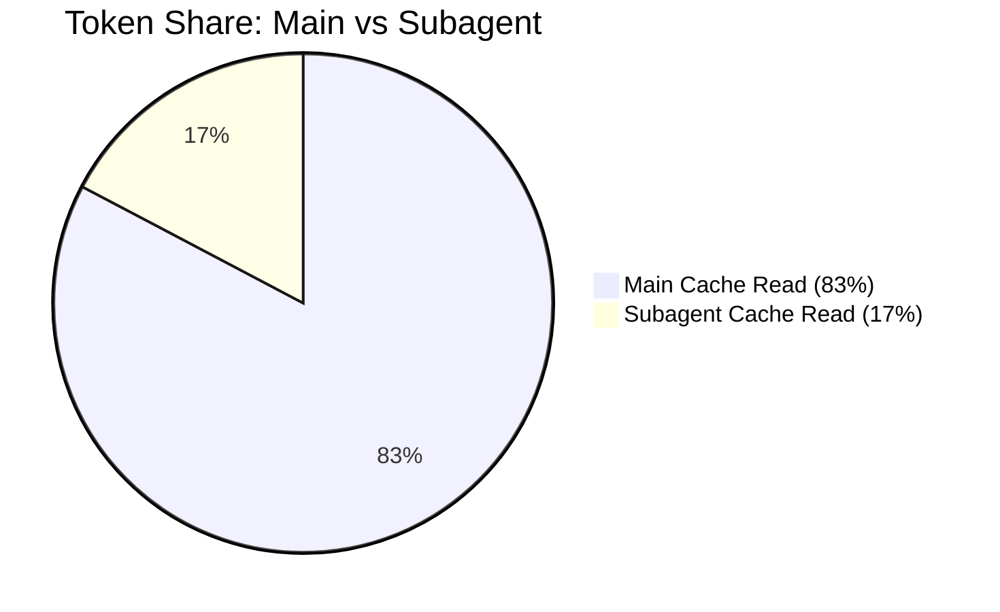
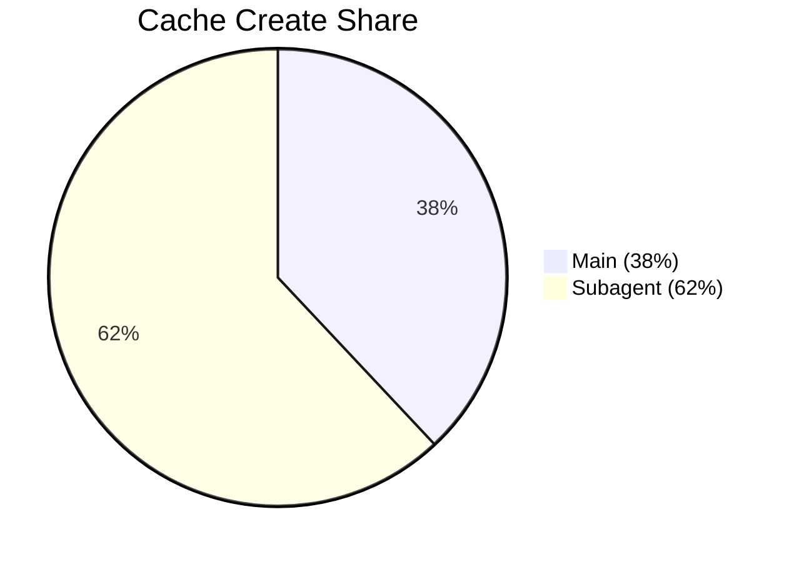
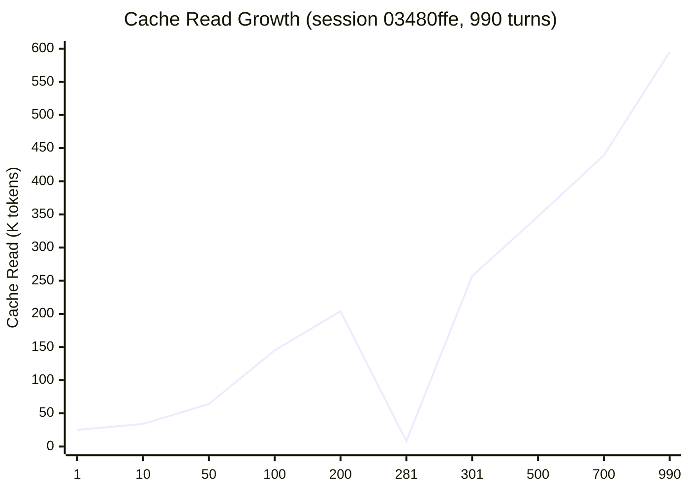

> **🇺🇸 [English Version](../03_JSONL-ANALYSIS.md)**

# JSONL 세션 로그 분석 — 1차 데이터

> **날짜:** 2026년 4월 8일 — 메인 세션 110개 + 서브에이전트 세션 279개 (JSONL, 4월 1-6일), v2.1.91, Max 20x ($200/월)
>
> **다른 문서와의 관계:** [02_RATELIMIT-HEADERS.md](02_RATELIMIT-HEADERS.md)는 프록시에서 수집한 서버 측 rate limit 헤더를 분석합니다. 이 문서는 클라이언트 측 JSONL 세션 로그(`~/.claude/projects/**/*.jsonl`)를 분석합니다. 섹션 6에서 JSONL과 프록시 데이터를 교차 대조합니다. 전체 프록시 데이터셋 및 JSONL 대량 스캔: **[13_PROXY-DATA.md](13_PROXY-DATA.md)**.

---

## 요약

JSONL 세션 로그는 모든 API 상호작용에 대한 클라이언트 측 기록입니다. HTTP 응답 헤더를 보는 프록시와 달리, JSONL은 PRELIM/FINAL 항목을 포함한 턴별 토큰 상세 내역, 합성 rate limit 이벤트, 모델 식별 정보를 캡처합니다.

**주요 발견:**
- **합성 rate limiting (B3):** 6일간 24건의 `<synthetic>` 항목 확인 (JSONL). 코퍼스 규모: 183/532 파일 (34.4%)에 합성 마커 포함, 257 파일에서 3,129건의 rate limit 텍스트 발생 (48.3%). [13_PROXY-DATA.md §12](13_PROXY-DATA.md#12-jsonl-bulk-scan-532-files-april-1-8) 참조
- **PRELIM 부풀리기 (B8):** PRELIM 5,551건 vs FINAL 6,825건 (전체 비율 0.81x, 사용량이 많은 날 최대 1.14x). 대량 스캔 (532 파일): 평균 인플레이션 2.37x, 최악의 경우 4.42x. [13_PROXY-DATA.md §12.3](13_PROXY-DATA.md#123-extended-thinking-inflation-b8--top-10-largest-sessions) 참조
- **서브에이전트 오버헤드:** 서브에이전트 279개 세션이 전체 cache_read의 17.3%를 소비하면서 전체 output의 40.4%를 차지했습니다. 콜드 스타트 중앙값: cache_create 토큰 13,358개. 프록시 확인: haiku 3,781건 요청 58.1% 캐시 vs opus 11,959건 98.8%
- **세션 성장:** 990턴 세션에서 cache_read가 24배 증가했습니다 (턴당 25K에서 595K로, 선형 +575). 프록시 (53 세션): **중앙값 1,845 tok/min** (P25: 801, P75: 3,581). [13_PROXY-DATA.md §3](13_PROXY-DATA.md#3-context-growth-rate-53-opus-sessions-20-requests-10-min) 참조
- **세션 비용 범위:** 가장 저렴한 세션과 가장 비싼 세션 간 753배 차이 (가시 토큰 447K에서 336M)
- **시간 정규화 비용:** cache_read 중앙값 분당 153K, 평균 분당 227K
- **프록시와의 교차 대조:** JSONL이 프록시 대비 **1.93x**의 cache_read 토큰을 기록 — PRELIM 이중 집계가 로컬 기록을 약 2배 부풀린다는 것을 직접 확인했습니다
- **Budget enforcement (프록시):** 218개 세션에서 167,818 이벤트 (4월 1~13일) — 100% 잘림률, 100%가 50자 이하. [13_PROXY-DATA.md §7](13_PROXY-DATA.md#7-budget-enforcement-bug-5--full-data) 참조
- **Microcompact (프록시):** 5,500 이벤트, 18,858 항목 삭제 (4월 1~13일). 메시지 수에 따라 확대: 10 미만에서 1.6 삭제 → 200+에서 6.6. [13_PROXY-DATA.md §8](13_PROXY-DATA.md#8-microcompact-bug-4--full-data) 참조

---

## 1. 일별 토큰 요약 (4월 1-6일)

메인 세션만 (서브에이전트 제외):

| 날짜 | 세션 수 | 항목 수 | Output | Cache Read | Cache Create | Input | 가시 토큰 합계 |
|-----|----------|---------|--------|------------|-------------|-------|---------------|
| 04-01 | 25 | 1,930 | 567,657 | 173,259,918 | 21,418,689 | 72,855 | 195,319,119 |
| 04-02 | 29 | 3,014 | 826,510 | 447,692,321 | 8,155,349 | 229,115 | 456,903,295 |
| 04-03 | 15 | 1,203 | 260,041 | 84,453,778 | 2,712,374 | 26,520 | 87,452,713 |
| 04-04 | 21 | 2,972 | 782,955 | 531,652,242 | 7,692,177 | 187,139 | 540,314,513 |
| 04-05 | 12 | 1,426 | 316,962 | 132,464,357 | 6,455,937 | 39,222 | 139,276,478 |
| 04-06 | 9 | 1,858 | 501,087 | 353,322,699 | 4,331,168 | 33,201 | 358,188,155 |

**항목별 평균:**

| 날짜 | Cache Read % | Create % | Output/항목 | Cache/항목 | 합계/항목 |
|-----|-------------|----------|-------------|-------------|-------------|
| 04-01 | 88.7% | 11.0% | 294 | 89,772 | 101,202 |
| 04-02 | 98.0% | 1.8% | 274 | 148,538 | 151,594 |
| 04-03 | 96.6% | 3.1% | 216 | 70,203 | 72,696 |
| 04-04 | 98.4% | 1.4% | 263 | 178,887 | 181,802 |
| 04-05 | 95.1% | 4.6% | 222 | 92,892 | 97,669 |
| 04-06 | 98.6% | 1.2% | 270 | 190,163 | 192,782 |

**관찰 사항:**
- **Cache Read %**는 88.7~98.4% 범위입니다. 4월 1일이 낮은 이유(88.7%)는 그날 세션을 25개나 새로 시작해서 cache_create가 많았기 때문입니다.
- **항목당 Output**은 216~294 토큰에 불과합니다 — 이는 눈에 보이는 output만 포함한 수치입니다. thinking이 켜져 있으면 실제 서버 측 턴당 output은 이보다 훨씬 많습니다.
- **항목당 Cache**는 70K~179K 범위입니다. 사용량이 많은 날(04-04)은 세션이 길어서 턴마다 누적된 대화 내역이 더 많았습니다.

### 버그 지표

| 날짜 | Synthetic (B3) | PRELIM | FINAL | P/F 비율 |
|-----|---------------|--------|-------|-----------|
| 04-01 | 4 | 911 | 1,015 | 0.90 |
| 04-02 | 4 | 1,399 | 1,611 | 0.87 |
| 04-03 | 3 | 556 | 643 | 0.86 |
| 04-04 | 4 | 1,229 | 1,737 | 0.71 |
| 04-05 | **9** | 754 | 663 | **1.14** |
| 04-06 | 0 | 702 | 1,156 | 0.61 |
| **합계** | **24** | **5,551** | **6,825** | **0.81** |

- **Synthetic (B3):** 총 24건입니다. 4월 5일에 9건으로 가장 집중되었습니다. 각각 실제 API 호출 없이 클라이언트가 만들어낸 가짜 "Rate limit reached"입니다.
- **PRELIM/FINAL 비율**은 thinking 사용량에 따라 0.61~1.14 범위입니다. 4월 5일은 1.14x (PRELIM이 FINAL보다 많음 — thinking 사용량 많음). 4월 6일은 0.61x (thinking 사용량 적음).

### PRELIM vs FINAL: 토큰 수준 비교

PRELIM 항목이 FINAL 항목과 동일한 토큰 수를 갖는지 비교했습니다:

| 날짜 | PRELIM cache_read | FINAL cache_read | P/F Cache 비율 | PRELIM output | FINAL output | P/F Output 비율 |
|-----|-------------------|------------------|-----------------|---------------|-------------|------------------|
| 04-01 | 73,581,649 | 99,678,269 | 0.74 | 22,329 | 545,328 | 0.04 |
| 04-02 | 187,693,131 | 259,999,190 | 0.72 | 30,416 | 796,094 | 0.04 |
| 04-03 | 34,939,821 | 49,362,008 | 0.71 | 14,217 | 237,824 | 0.06 |
| 04-04 | 191,259,356 | 340,298,839 | 0.56 | 24,726 | 742,229 | 0.03 |
| 04-05 | 65,313,689 | 67,150,668 | 0.97 | 22,956 | 294,006 | 0.08 |
| 04-06 | 135,483,323 | 217,839,376 | 0.62 | 13,028 | 488,059 | 0.03 |

**PRELIM cache_read는 FINAL cache_read의 0.56~0.97배**입니다. 상당한 양이지만 1:1은 아닙니다. 비율은 날마다 다릅니다. PRELIM output은 FINAL의 0.03~0.08배에 불과합니다 (PRELIM 항목에는 눈에 보이는 output이 거의 없습니다 — "thinking in progress" 중간 스냅샷이기 때문입니다).

**이것이 의미하는 바:** PRELIM 부풀리기(B8)는 실제 FINAL 값 위에 대략 56~97%의 cache_read를 추가로 더합니다. 만약 서버가 PRELIM 항목을 전체 가중치로 집계한다면, 사용자는 cache_read에 대해 1.56~1.97배를 소비하는 셈입니다.

---

## 2. 세션 비용 분포

모든 세션이 같지는 않습니다. 가장 저렴한 세션과 가장 비싼 세션 간 753배 차이는 비용이 얼마나 극적으로 달라지는지 보여줍니다:

### 가장 비싼 세션 상위 10개

| 날짜 | 세션 | 가시 토큰 합계 | 항목 수 | Cache Read | Output |
|-----|---------|--------------|---------|------------|--------|
| 04-04 | 03480ffe | **336,360,170** | 990 | 333,169,783 | 266,151 |
| 04-02 | 63e79b5e | 163,952,464 | 609 | 161,907,520 | 155,012 |
| 04-06 | b926be34 | 126,541,892 | 460 | 124,243,773 | 180,303 |
| 04-06 | ae47b46b | 102,192,853 | 694 | 101,261,459 | 83,175 |
| 04-02 | 158a1b9d | 69,083,572 | 354 | 68,264,817 | 98,020 |
| 04-01 | 888b0e4b | 60,747,270 | 258 | 59,511,929 | 123,305 |
| 04-02 | 89bdbe06 | 48,365,855 | 327 | 47,806,054 | 100,093 |
| 04-02 | 23d083a1 | 42,169,722 | 265 | 41,368,814 | 94,055 |
| 04-02 | 48557289 | 40,430,993 | 309 | 39,400,900 | 69,508 |
| 04-04 | 0c024075 | 39,933,209 | 284 | 39,283,156 | 69,145 |

### 하위 5개 (10개 이상 항목이 있는 가장 저렴한 세션)

| 날짜 | 세션 | 가시 토큰 합계 | 항목 수 | Cache Read | Output |
|-----|---------|--------------|---------|------------|--------|
| 04-05 | 41549298 | 446,988 | 12 | 419,350 | 2,685 |
| 04-06 | fb0c85e5 | 463,571 | 12 | 430,191 | 2,093 |
| 04-02 | 79388f46 | 474,370 | 13 | 429,085 | 5,073 |
| 04-02 | 22b91f19 | 501,069 | 13 | 401,350 | 4,903 |
| 04-03 | 30f6ba7a | 587,411 | 17 | 538,729 | 4,652 |

### 분포

| 지표 | 값 |
|--------|-------|
| 분석 대상 세션 | 78개 (10개 이상 항목, 1분 이상 지속) |
| 비용 범위 | 446,988 — 336,360,170 (**753x**) |
| 중앙값 | 8,581,558 |
| 평균 | 21,620,755 |

가장 비싼 세션(03480ffe, 990턴, 가시 토큰 336M)은 **중앙값 세션 38개를 합친 것**만큼 소비했습니다. 이는 cache_read가 대화 길이에 따라 선형으로 증가하기 때문에 생기는 자연스러운 결과입니다 — 긴 세션은 불균형적으로 비쌉니다.

---

## 3. 시간 정규화 비용

단순히 토큰 총량만 비교하면, 작업 시간이 다른 세션이나 날짜를 비교할 때 오해가 생길 수 있습니다. 시간 정규화 지표가 더 공정한 비교를 가능하게 합니다:

### 세션 지속 시간 분포 (n=78)

| 지표 | 값 |
|--------|-------|
| 중앙값 지속 시간 | 49분 (0.8시간) |
| 평균 지속 시간 | 158분 (2.6시간) |
| 최소 | 1분 |
| 최대 | 1,372분 (22.9시간) |

### 분당 Cache read

| 지표 | 값 |
|--------|-------|
| 중앙값 | **153,018 tokens/min** |
| 평균 | 226,675 tokens/min |
| 최소 | 8,397 tokens/min |
| 최대 | 864,186 tokens/min |

### 분당 Output

| 지표 | 값 |
|--------|-------|
| 중앙값 | **574 tokens/min** |
| 평균 | 744 tokens/min |

**이것이 왜 중요한가:** 기간별 예산 절감을 비교할 때, 총 토큰 소비량에는 "얼마나 오래 작업했는지"와 "분당 비용이 얼마인지"가 모두 포함됩니다. 16시간 작업에 cache_read 2.7B(시간당 168M) vs 2시간 작업에 cache_read 123M(시간당 62M)을 비교하면 총량 차이는 22배이지만, **시간당 비용 차이는 2.7배에 불과**합니다. 시간당 지표를 쓰면 실제 비용 변화를 작업 시간 차이로부터 분리할 수 있습니다.

이 점은 커뮤니티 분석(예: @fgrosswig의 3월 30일 vs 4월 6일 비교)에서도 중요합니다. 총량끼리만 비교하면 작업 시간과 시간당 비용 변화가 뒤섞여서 예산 절감을 과대 평가할 수 있습니다.

---

## 4. 메인 세션 vs 서브에이전트

| 지표 | 메인 세션 | 서브에이전트 | 서브에이전트 비중 |
|--------|--------------|-----------|----------------|
| 파일 수 | 110 | 279 | — |
| 항목 수 | 11,983 | 10,178 | — |
| Output | 3,100,588 | 2,100,541 | **40.4%** |
| Cache Read | 1,607,617,725 | 335,964,567 | **17.3%** |
| Cache Create | 50,302,333 | 82,034,105 | **62.0%** |
| Input | 564,967 | 3,477,557 | — |
| Cache Read % | 96.9% | 79.7%* | — |
| 항목당 평균 cache_read | **134,158** | **33,009** | 4.1x |

*\*79.7%는 항목별 가중 평균(전체 서브에이전트 cache_read / 전체 서브에이전트 가시 토큰)이며, 세션별 비율의 단순 평균이 아닙니다. 항목이 많은 세션이 이 수치에 비례적으로 더 많이 기여합니다.*

### 서브에이전트 콜드 스타트 비용

| 지표 | 값 |
|--------|-------|
| 샘플 수 | 서브에이전트 세션 279개 |
| 중앙값 cache_create (첫 번째 턴) | **13,358 tokens** |
| 평균 | 12,105 |
| P25 — P75 | 7,205 — 16,703 |
| 최소 — 최대 | 491 — 25,075 |

서브에이전트를 하나 만들 때마다 첫 번째 턴에 대략 **cache_create 13K 토큰**이 듭니다. 6일간 서브에이전트 세션 279개를 만들었으므로, 콜드 스타트만으로 약 3.7M 토큰이 사용된 셈입니다.

### 서브에이전트 워밍 곡선

| 지표 | 값 |
|--------|-------|
| 샘플 수 | 9,403 항목 (턴 4 이후) |
| 중앙값 cache_read % | **92.3%** |
| 평균 | 81.7% |
| P25 — P75 | 78.1% — 97.6% |
| 최소 — 최대 | 0.0% — 100.0% |

3턴 이상 후, 서브에이전트의 cache_read는 **중앙값 92.3%**로 안정됩니다 — 메인 세션(96.9%)보다 낮지만 기능적으로 충분한 수준입니다. P25의 78.1%는 일부 서브에이전트가 완전히 워밍되지 않았음을 보여주는데, 이는 수명이 짧은 서브에이전트(5턴 미만으로 실행되는 경우가 많음) 때문입니다.

**이것이 의미하는 바:**
- 서브에이전트는 **output의 40%**를 생산하면서 **cache_read의 17%**만 소비합니다 — 서브에이전트는 컨텍스트가 짧아서 턴당 부하가 가볍습니다(33K vs 134K).
- 서브에이전트는 **cache_create의 62%**를 차지합니다 — 자주 콜드 스타트하기 때문입니다. 이것이 생성당 약 13K 토큰이 드는 비싼 작업입니다.
- Agent tool 호출을 많이 하는 사용자는 cache_create에서 불균형적으로 많이 지불하지만, 턴당 cache_read는 절약됩니다.

---

## 5. 세션 라이프사이클 — 캐시 증가 곡선

가장 긴 세션을 분석했습니다 (03480ffe, 990 항목, 가시 토큰 336M):

| 턴 | Cache Read | 턴 1 대비 증가 | Cache Read % |
|------|-----------|-------------------|-------------|
| 1 | 24,820 | — | 76.2% |
| 10 | 34,131 | 1.4x | 94.3% |
| 50 | 63,942 | 2.6x | 99.0% |
| 100 | 145,104 | 5.8x | 99.3% |
| 200 | 204,247 | 8.2x | 99.1% |
| 281 | **8,237** | **0.3x (이상치)** | **3.4%** |
| 301 | 257,309 | 10.4x | 97.4% |
| 500 | 347,470 | 14.0x | 99.8% |
| 700 | 439,024 | 17.7x | 99.8% |
| 990 | 595,141 | **24.0x** | 100.0% |

**증가는 선형**입니다 — 대략 **턴당 cache_read +575 토큰**씩 증가합니다. 이는 대화 이력이 누적되기 때문입니다. 턴 990에서는 매 API 호출마다 약 595K 토큰의 캐시된 컨텍스트를 전송합니다.

**턴 281의 이상치:** cache_read가 약 222K에서 8,237로 급감하면서 cache_create가 237,490으로 급증했습니다. 이는 세션 중간에 캐시가 재구축된 것으로, microcompact(B4)나 서버 측 캐시 삭제(eviction)에 의해 발생했을 가능성이 있습니다. 이전 수준으로 복구되는 데 약 20턴이 걸렸습니다.

**사용률에 대한 시사점:** 5시간 사용률의 1%가 약 1.5M~2.1M 가시 토큰에 해당한다면 ([02_RATELIMIT-HEADERS.md](02_RATELIMIT-HEADERS.md)):
- 세션 초반 (턴 10, 턴당 캐시 약 34K): 1%당 약 44~62턴
- 세션 중반 (턴 500, 턴당 캐시 약 347K): 1%당 약 4~6턴
- 세션 후반 (턴 990, 턴당 캐시 약 595K): 1%당 약 2.5~3.5턴

**긴 세션 후반부에서 100턴만 써도 5시간 한도의 약 17~40%가 cache_read만으로 소진됩니다.** 이것이 긴 세션일수록 더 빨리 소진되는 이유입니다 — 사용자의 작업 속도가 일정하더라도 턴당 비용이 가속됩니다.

---

## 6. 교차 대조: JSONL vs 프록시

두 데이터 소스 모두 같은 기간(4월 4~6일)의 같은 API 호출을 대상으로 하지만, 측정하는 대상이 다릅니다:
- **JSONL**: 클라이언트가 기록한 내용 — PRELIM 항목 포함
- **프록시**: 서버가 단일 HTTP 응답으로 반환한 내용을 기록

양쪽 소스의 시간별 합계를 비교했습니다 (겹치는 33시간):

| 지표 | JSONL 합계 | 프록시 합계 | 비율 |
|--------|-------------|-------------|-------|
| Output 토큰 | 1,372,025 | 1,968,953 | **0.70x** |
| Cache Read 토큰 | 663,021,317 | 344,380,772 | **1.93x** |

### Cache Read: JSONL이 프록시의 1.93배

이 수치는 버그 8(PRELIM 부풀리기)을 직접 측정으로 확인한 것입니다. JSONL은 FINAL 항목과 **비슷한** (0.56~0.97배) `cache_read_input_tokens`를 가진 PRELIM 항목을 기록하여 실질적으로 수치를 부풀립니다. 약 2배라는 비율은 섹션 1의 PRELIM/FINAL 토큰 분석과 일치합니다 (PRELIM cache가 FINAL의 0.56~0.97배이므로, 전체 JSONL = FINAL + PRELIM ≈ FINAL만의 1.56~1.97배, 1.93배와 부합).

### Output: JSONL이 프록시의 0.70배

JSONL이 프록시보다 적은 output 토큰을 기록했습니다. 이는 주로 타이밍/매칭 오차 때문입니다 — 서브에이전트 JSONL 파일의 수정 시간과 프록시가 해당 요청을 기록한 시간이 달라서, 일부 항목이 매칭된 시간별 윈도우 밖으로 빠진 것입니다.

### JSONL을 통해 사용량을 추적하는 사용자에게 의미하는 바

- JSONL 파일에서 `cache_read_input_tokens`를 합산하면, 그 합계는 실제로 API에 전송된 것보다 **약 2배 높습니다** — PRELIM 항목이 수치를 중복시키기 때문입니다.
- 만약 Anthropic의 서버 측 rate limiter가 PRELIM 항목을 생성하는 것과 같은 방식으로 토큰을 집계한다면, 사용자는 cache_read에 대해 이중으로 과금될 수 있습니다. 클라이언트 측에서 이를 확인할 수는 없지만, 1.93배라는 비율은 이 가설과 일치합니다.

### 방법론 참고: 시간 정규화

서로 다른 기간의 토큰 합계를 비교할 때는, **반드시 작업 시간이나 활동 분 기준으로 정규화해야 합니다**. 총량끼리만 비교하면 "얼마나 오래 작업했는지"와 "분당 비용이 얼마인지"가 혼동됩니다. 예를 들어, 16시간 x 시간당 168M = 총 2.7B vs 2시간 x 시간당 62M = 총 123M은 총량 차이가 22배이지만, 시간당 비용 차이는 2.7배에 불과합니다. 시간 정규화 지표는 섹션 3을 참고하시기 바랍니다.

---

## 7. 제한 사항

- **JSONL 타임스탬프:** 모든 항목에 정밀한 타임스탬프가 있지는 않습니다. 교차 대조에서 시간별 구간(bucket)을 사용했기 때문에 매칭 오차가 발생합니다. 개별 시간대에서 타이밍 불일치로 극단적인 비율(35배 이상)이 나타날 수 있습니다.
- **서브에이전트 귀속:** 서브에이전트 JSONL 파일은 부모 세션별로 저장됩니다. 파일 수정 시간이 실제 요청 시간을 반영하지 않을 수 있습니다.
- **thinking 토큰 비가시:** 프록시와 마찬가지로, JSONL의 `output_tokens`에는 extended thinking 토큰이 포함되지 않습니다. 실제 서버 측 턴당 output은 기록된 것보다 높습니다.
- **6일 윈도우:** 4월 1~6일만 분석한 결과입니다. 더 긴 기간을 관찰하면 주간 패턴이 드러날 수 있습니다.
- **단일 요금제 티어:** Max 20x ($200/월) 기준입니다. 다른 티어에서는 항목별 오버헤드 특성이 다를 수 있습니다.
- **PRELIM 감지 휴리스틱:** PRELIM 항목은 비어있거나 null인 `stop_reason`으로 식별했습니다. 같은 조건의 다른 항목 유형이 잘못 집계되었을 가능성이 있습니다.

---

## 8. 종합: JSONL + 프록시

| 질문 | JSONL 답변 | 프록시 답변 | 종합 |
|----------|-------------|--------------|----------|
| 턴당 Cache_read? | 메인 134K, 서브에이전트 33K | — | ✓ 측정됨 |
| 턴당 캐시 증가? | +575 tokens/turn (선형) | — | ✓ 측정됨 |
| 분당 Cache_read? | 중앙값 153K/min | — | ✓ 측정됨 |
| 1% 사용률의 비용? | — | 1.5M-2.1M 가시 토큰 | ✓ 측정됨 |
| PRELIM 항목이 수치를 부풀리는가? | 예 (0.81x P/F 비율) | 예 (JSONL이 프록시의 1.93x) | **✓ 양쪽에서 확인** |
| PRELIM cache vs FINAL cache? | 0.56-0.97x (1:1 아님) | — | ✓ 측정됨 |
| 합성 rate limit이 실재하는가? | 6일간 24건 | — | ✓ 측정됨 |
| 서브에이전트 콜드 스타트 비용? | 중앙값 cache_create 13,358 | — | ✓ 측정됨 |
| 서브에이전트 워밍 캐시 %? | 중앙값 92.3% (턴 4 이후) | — | ✓ 측정됨 |
| 세션 비용 범위? | 753x (가시 토큰 447K-336M) | — | ✓ 측정됨 |
| thinking 토큰이 집계되는가? | 확인 불가 | 확인 불가 | **여전히 미확인** |
| 서버 토큰 유형별 가중치? | — | 분해 불가 | **여전히 미확인** |

두 가지 남은 미확인 사항 — thinking 토큰 회계와 서버 측 토큰 가중치 — 은 Anthropic의 공식 공개 또는 이번 주 계획된 thinking 비활성화 격리 테스트가 필요합니다.

---

## Appendix A: 시간별 데이터 그리드 (JSONL 전체 세션 — 메인 + 서브에이전트)

50건 이상 항목이 있는 시간만 표시합니다. 전체 데이터셋은 2026년 4월 1-6일 (UTC)을 다룹니다.

| Hour (UTC) | Entries | Output | Cache Read | Cache Create | Synthetic | PRELIM | FINAL |
|------------|--------|--------|------------|-------------|-----------|--------|-------|
| 04-01T00 | 389 | 130,065 | 35,234,018 | 716,913 | 0 | 191 | 198 |
| 04-01T01 | 305 | 94,931 | 43,027,056 | 913,611 | 0 | 154 | 151 |
| 04-01T02 | 204 | 72,350 | 34,744,866 | 269,215 | 0 | 76 | 128 |
| 04-01T03 | 79 | 16,947 | 13,632,765 | 1,695,887 | 0 | 31 | 48 |
| 04-01T04 | 168 | 64,094 | 11,834,661 | 1,162,842 | 0 | 75 | 93 |
| 04-01T05 | 112 | 23,925 | 2,991,981 | 8,394,712 | 0 | 51 | 61 |
| 04-01T06 | 53 | 10,304 | 591,448 | 3,695,356 | 1 | 19 | 33 |
| 04-01T08 | 78 | 10,570 | 1,027,516 | 1,991,228 | 0 | 34 | 44 |
| 04-01T09 | 130 | 36,142 | 6,856,721 | 643,068 | 1 | 61 | 68 |
| 04-01T10 | 189 | 41,809 | 12,846,688 | 404,192 | 0 | 101 | 88 |
| 04-01T11 | 69 | 16,724 | 10,000,558 | 84,459 | 0 | 29 | 40 |
| 04-01T12 | 83 | 25,008 | 7,627,403 | 158,323 | 0 | 42 | 41 |
| 04-01T22 | 66 | 15,790 | 10,961,407 | 42,139 | 0 | 14 | 52 |
| 04-01T23 | 133 | 37,583 | 6,282,145 | 471,344 | 0 | 86 | 47 |
| 04-02T00 | 506 | 155,854 | 57,797,245 | 1,255,725 | 0 | 261 | 245 |
| 04-02T01 | 417 | 105,009 | 57,478,025 | 728,877 | 0 | 218 | 199 |
| 04-02T02 | 531 | 170,540 | 112,841,075 | 2,269,831 | 3 | 238 | 290 |
| 04-02T03 | 263 | 54,035 | 67,586,455 | 251,630 | 0 | 102 | 161 |
| 04-02T04 | 386 | 108,469 | 49,008,927 | 1,184,661 | 1 | 182 | 203 |
| 04-02T05 | 247 | 60,096 | 38,093,933 | 206,106 | 0 | 90 | 157 |
| 04-02T06 | 52 | 12,946 | 8,804,049 | 52,356 | 0 | 15 | 37 |
| 04-02T15 | 301 | 59,421 | 23,193,271 | 563,409 | 1 | 135 | 165 |
| 04-02T16 | 58 | 8,255 | 4,685,862 | 138,018 | 0 | 28 | 30 |
| 04-02T17 | 206 | 48,828 | 16,995,785 | 204,872 | 0 | 68 | 138 |
| 04-02T21 | 97 | 13,429 | 4,071,685 | 233,632 | 0 | 55 | 42 |
| 04-02T22 | 195 | 39,381 | 11,892,785 | 558,199 | 1 | 106 | 88 |
| 04-02T23 | 102 | 20,803 | 5,084,026 | 211,964 | 0 | 55 | 47 |
| 04-03T00 | 216 | 66,913 | 24,476,045 | 541,620 | 0 | 100 | 116 |
| 04-03T01 | 330 | 84,131 | 78,646,938 | 2,461,625 | 5 | 144 | 181 |
| 04-03T02 | 248 | 60,545 | 98,032,051 | 199,657 | 0 | 86 | 162 |
| 04-03T03 | 90 | 22,274 | 43,862,998 | 64,566 | 0 | 21 | 69 |
| 04-03T04 | 122 | 31,699 | 65,962,917 | 84,870 | 0 | 36 | 86 |
| 04-03T06 | 166 | 40,002 | 24,972,321 | 224,897 | 0 | 60 | 106 |
| 04-03T14 | 76 | 20,497 | 5,369,588 | 120,679 | 0 | 18 | 58 |
| 04-03T15 | 124 | 48,573 | 10,578,844 | 198,689 | 0 | 69 | 54 |
| 04-04T00 | 60 | 13,593 | 4,008,263 | 619,547 | 0 | 32 | 28 |
| 04-04T01 | 218 | 45,017 | 15,814,301 | 574,946 | 0 | 86 | 132 |
| 04-04T02 | 252 | 58,591 | 34,358,168 | 440,197 | 0 | 135 | 117 |
| 04-04T03 | 314 | 65,399 | 27,765,417 | 528,688 | 0 | 158 | 156 |
| 04-04T04 | 79 | 21,098 | 4,584,805 | 158,716 | 0 | 36 | 43 |
| 04-04T05 | 141 | 18,514 | 8,892,255 | 238,306 | 0 | 66 | 75 |
| 04-04T06 | 72 | 11,050 | 7,547,155 | 42,904 | 0 | 33 | 39 |
| 04-04T11 | 124 | 32,170 | 15,136,178 | 397,115 | 0 | 48 | 76 |
| 04-04T12 | 54 | 34,569 | 3,559,586 | 121,601 | 0 | 17 | 36 |
| 04-04T13 | 61 | 20,215 | 5,390,607 | 153,114 | 0 | 19 | 42 |
| 04-04T14 | 328 | 102,198 | 48,194,992 | 460,172 | 0 | 118 | 210 |
| 04-04T22 | 283 | 49,910 | 16,432,240 | 1,617,418 | 2 | 177 | 104 |
| 04-04T23 | 121 | 25,556 | 12,158,889 | 138,953 | 0 | 61 | 60 |
| 04-05T04 | 53 | 10,285 | 2,463,098 | 332,913 | 0 | 37 | 16 |
| 04-05T05 | 453 | 92,991 | 47,579,878 | 1,665,956 | 1 | 191 | 261 |
| 04-05T06 | 168 | 37,740 | 18,376,958 | 305,179 | 0 | 75 | 93 |
| 04-05T09 | 158 | 39,929 | 13,943,379 | 681,542 | 1 | 73 | 84 |
| 04-05T10 | 176 | 36,773 | 16,840,145 | 1,048,552 | 1 | 84 | 91 |
| 04-05T12 | 157 | 34,253 | 17,515,016 | 510,358 | 3 | 82 | 72 |
| 04-05T13 | 52 | 18,513 | 5,033,990 | 51,576 | 0 | 11 | 41 |
| 04-05T14 | 122 | 32,031 | 11,027,184 | 793,276 | 1 | 53 | 68 |
| 04-05T15 | 153 | 47,630 | 21,898,419 | 252,159 | 0 | 71 | 82 |
| 04-05T22 | 91 | 31,861 | 9,890,214 | 201,216 | 0 | 47 | 44 |
| 04-05T23 | 50 | 11,787 | 8,004,948 | 244,134 | 0 | 15 | 35 |
| 04-06T00 | 149 | 67,941 | 27,682,717 | 298,649 | 0 | 60 | 89 |
| 04-06T01 | 144 | 39,822 | 38,870,639 | 154,155 | 0 | 54 | 90 |
| 04-06T02 | 173 | 34,229 | 45,493,247 | 149,881 | 0 | 73 | 100 |
| 04-06T03 | 53 | 8,116 | 7,646,424 | 302,047 | 0 | 21 | 32 |
| 04-06T04 | 349 | 105,626 | 91,581,938 | 1,641,011 | 0 | 147 | 202 |

---

## Appendix B: 프록시 시간별 사용률 그리드 (4월 4-6일)

cc-relay 프록시를 통해 캡처한 rate limit 헤더입니다. 각 행은 1시간(KST) 단위입니다.

| Hour (KST) | Reqs | Output | Cache Read | Input | 5h util | 7d util |
|-------------|------|--------|------------|-------|---------|---------|
| 04-04 09 | 74 | 34,368 | 2,523,601 | 244,743 | 4% | 6% |
| 04-04 10 | 304 | 154,768 | 12,224,810 | 1,092,266 | 16% | 8% |
| 04-04 11 | 410 | 179,010 | 27,317,171 | 48,757 | 23% | 9% |
| 04-04 12 | 388 | 158,247 | 23,770,875 | 62,670 | 32% | 10% |
| 04-04 13 | 156 | 91,357 | 3,577,083 | 649,641 | 39% | 11% |
| 04-04 14 | 77 | 16,938 | 4,778,807 | 4,100 | 2% | 11% |
| 04-04 15 | 39 | 10,282 | 4,129,802 | 49 | 2% | 11% |
| 04-04 18 | 16 | 6,503 | 1,807,402 | 20 | 4% | 11% |
| 04-04 20 | 93 | 39,232 | 9,215,178 | 69,206 | 4% | 12% |
| 04-04 21 | 89 | 61,574 | 3,441,361 | 435,855 | 9% | 12% |
| 04-04 22 | 80 | 46,656 | 5,023,044 | 31,703 | 11% | 13% |
| 04-04 23 | 371 | 212,743 | 37,866,810 | 32,748 | 27% | 15% |
| 04-05 07 | 13 | 4,484 | 317,744 | 4,990 | 5% | 15% |
| 04-05 08 | 38 | 13,034 | 2,042,313 | 600 | 8% | 16% |
| 04-05 13 | 19 | 9,367 | 905,905 | 26 | 1% | 16% |
| 04-05 14 | 375 | 161,991 | 29,579,110 | 179,609 | 17% | 18% |
| 04-05 15 | 198 | 126,249 | 12,448,681 | 365,714 | 26% | 19% |
| 04-05 16 | 24 | 1,979 | 2,463,947 | 40 | 26% | 19% |
| 04-05 18 | 165 | 65,864 | 9,575,191 | 162,835 | 7% | 20% |
| 04-05 19 | 167 | 73,519 | 10,659,315 | 251,812 | 15% | 21% |
| 04-05 21 | 90 | 34,033 | 8,511,367 | 23,111 | 20% | 22% |
| 04-05 22 | 44 | 19,008 | 3,259,353 | 69 | 21% | 22% |
| 04-05 23 | 200 | 115,995 | 12,659,554 | 112,454 | 13% | 24% |
| 04-06 00 | 112 | 69,549 | 13,537,745 | 213 | 18% | 25% |
| 04-06 01 | 18 | 1,335 | 2,288,596 | 29 | 18% | 25% |
| 04-06 02 | 18 | 1,386 | 2,673,247 | 33 | 18% | 25% |
| 04-06 03 | 20 | 1,811 | 2,924,441 | 34 | 18% | 25% |
| 04-06 04 | 18 | 1,510 | 2,007,438 | 28 | 0% | 25% |
| 04-06 05 | 18 | 1,538 | 2,750,357 | 32 | 0% | 25% |
| 04-06 06 | 25 | 7,601 | 3,291,379 | 453 | 1% | 25% |
| 04-06 07 | 43 | 15,252 | 2,959,928 | 373 | 2% | 25% |

---

*환경: Max 20x ($200/월), Opus 4.6 1M, v2.1.91, Linux (ubuntu-1), 단일 머신. JSONL 파일 1,735개, 총 1.0 GB. 프록시 교차 대조 부분집합: 8,794건 요청, rate limit 헤더 포함 3,702건 (4월 4-6일). 전체 프록시 데이터셋 (17,610건 요청, 4월 1-8일) 및 JSONL 대량 스캔 (532개 파일): [13_PROXY-DATA.md](13_PROXY-DATA.md).*
